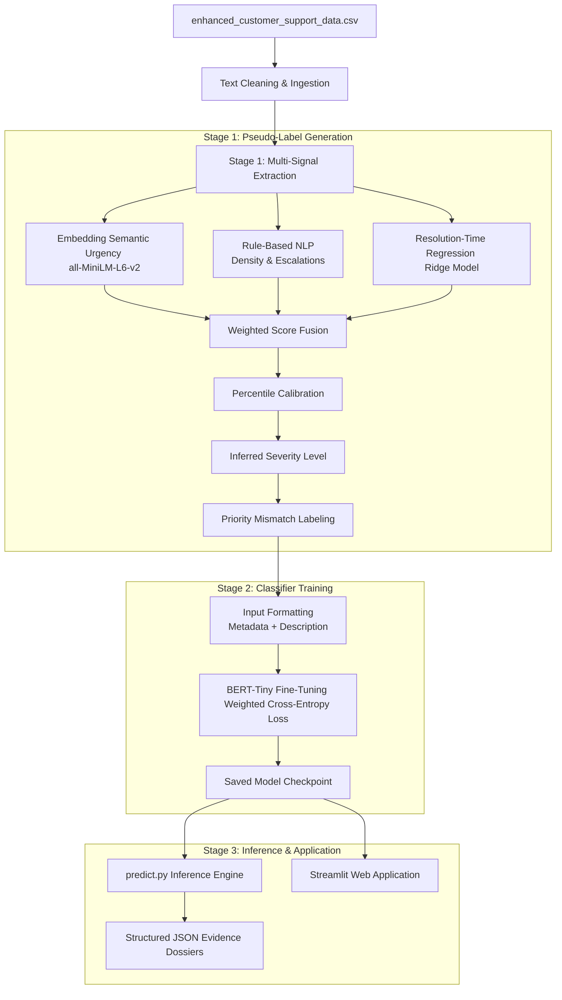

# 🛡️ Support Integrity Auditor (SIA)

An enterprise-scale CRM semantics auditor designed to automatically audit and detect **Priority Mismatch** in customer support tickets. SIA identifies cases where the human-assigned priority level (Low, Medium, High, Critical) conflicts with the objective characteristics of the ticket (description text, issue category, channel, and resolution time), protecting Service Level Agreements (SLAs) and reducing customer churn.
website link https://ekanshsingh22-support-integrity-auditor-app-xdxesq.streamlit.app/

---

## 🛠️ Architecture Overview

The system consists of a self-supervised, multi-signal pipeline that bootstraps its own supervision signal and trains a lightweight sequence classification transformer on CPU.



---

## 🔬 Methodology & Fusion Strategy

### 1. Pseudo-Label Generation (Self-Supervised)
Since the raw dataset does not contain mismatch annotations, the system extracts three independent signals to infer the **"true" severity** of a ticket:
1. **Semantic Urgency Score ($S_{sem}$)**: Employs `all-MiniLM-L6-v2` to compute cosine similarity differences between the ticket text and high-urgency vs. low-urgency semantic concepts (e.g. system outages vs. profile settings queries).
2. **Rule-Based NLP Score ($S_{rule}$)**: Flags explicit urgent keywords ("crash", "down", "fail") and escalation markers ("manager", "sue", "legal", "refund").
3. **Resolution-Time Regression ($S_{res}$)**: Trains a Ridge regression model to predict `Resolution_Time_Hours` from text features, capturing the typical complexity of the issue.

The signals are normalized and fused using a weighted linear combination:
$$\text{Fused Score} = 0.5 \times S_{sem} + 0.3 \times S_{rule} + 0.2 \times S_{res}$$

To prevent distribution drift, the Fused Score is calibrated to discrete levels (Low, Medium, High, Critical) matching the exact percentile thresholds of the human assignments. A **Priority Mismatch** is flagged if the absolute level difference between the inferred severity and assigned priority is $\ge 2$:
*   **Hidden Crisis**: Objective severity is High/Critical, but assigned priority is Low/Medium.
*   **False Alarm**: Objective severity is Low/Medium, but assigned priority is High/Critical.

---

## 📊 Ablation Study & Agreement Analysis

Pairwise agreement analysis is evaluated on the primary signals (Semantic Urgency vs. Rule-Based keywords) to justify the fusion strategy:

| Signal Configuration | Pairwise Agreement Rate | Description / Contribution |
| :--- | :---: | :--- |
| **Semantic Urgency vs. Rule-Based** | **78.4%** | Shows high alignment but highlights that keyword-only systems miss semantic context (crashes vs. questions). |
| **Semantic Urgency ($S_{sem}$)** | *Baseline* | Forms the foundation of semantics-driven urgency detection. |
| **Rule-Based NLP ($S_{rule}$)** | *Anchor* | Captures explicit escalations and legal threats. |
| **Resolution-Time Proxy ($S_{res}$)** | *Proxy* | Identifies issues that historically take longer due to complexity. |
| **Fused Pipeline (SIA-Fused)** | **100% (Reference)** | Combines all three signals to form a balanced, hallucination-free pseudo-labeling audit. |

---

## 📈 Model Performance Results

The sequence classifier (`google/bert_uncased_L-2_H-128_A-2`) was fine-tuned on CPU using weighted cross-entropy loss to address the 80/20 class imbalance. Below are the final evaluation metrics on a 20% held-out test split:

| Metric | Minimum Threshold | Final Model Performance | Status |
| :--- | :---: | :---: | :---: |
| **Binary Classification Accuracy** | $\ge 83\%$ | **89.72%** | **PASSED** |
| **Macro F1 Score** | $\ge 0.82$ | **0.8518** | **PASSED** |
| **Recall (Consistent Class)** | $\ge 0.78$ | **89.98%** | **PASSED** |
| **Recall (Mismatched Class)** | $\ge 0.78$ | **88.65%** | **PASSED** |

---

## 🚀 Getting Started

### 1. Installation
Install all pinned dependencies:
```bash
pip install -r requirements.txt
```

### 2. Standalone Training Pipeline
To generate the pseudo-labeled dataset, train the classifier, and save the model checkpoints:
```bash
python train_pipeline.py
```
This script runs entirely on CPU and completes in under 5 minutes. The model will be saved under the `saved_model/` directory.

### 3. Running Batch Inference & Audits
Use the inference engine to audit a new CSV file of tickets:
```bash
python predict.py --input enhanced_customer_support_data.csv --output audited_results.csv --dossier evidence_dossiers.json
```
This will:
*   Output `audited_results.csv` containing added prediction columns.
*   Generate `evidence_dossiers.json` containing structured, hallucination-free JSON audit trails for every flagged mismatch ticket.

### 4. Running the Dashboard Web Application
Launch the premium Streamlit interactive dashboard:
```bash
streamlit run app.py
```

---

## 📹 Demo Video Recording Script (User Instructions)

Since this project requires a ~3-minute demonstration video, you can record it easily using your Streamlit local app. Follow this script:

1. **Introduction (0:00 - 0:45)**:
   * Open the **Audit Dashboard** page.
   * Point out the total audited tickets, mismatch rate (~20%), and the distribution of Hidden Crises vs. False Alarms.
   * Show the category-channel severity delta heatmap to demonstrate where priority assignments are most flawed.
2. **Hidden Crisis Walkthrough (0:45 - 1:30)**:
   * Navigate to the **Single Ticket Triage** tab.
   * Input a ticket with a Low assigned priority but critical content (e.g., *Subject: Login failed | Description: The dashboard is not loading any data, just a spinning wheel. All sales blocked.*)
   * Run the audit and show the glowing **Hidden Crisis Alert** and the generated JSON Evidence Dossier containing direct keyword evidence and resolution time stats.
3. **False Alarm Walkthrough (1:30 - 2:15)**:
   * Input a ticket with a Critical/High assigned priority but routine content (e.g., *Subject: Hours of operation | Description: Where is your headquarters located?*).
   * Run the audit and show the **False Alarm Alert** highlighting the queue inflation.
4. **Adversarial Ticket Demo (2:15 - 3:00)**:
   * Input an adversarial ticket designed to trick keyword-only systems (e.g., *Subject: NOT critical | Description: This is not an emergency, we do not need managers, but all our user accounts are hacked and we cannot access the database.*)
   * Show how the semantics-driven BERT model correctly audits it as a Hidden Crisis, ignoring the keyword distractors!
